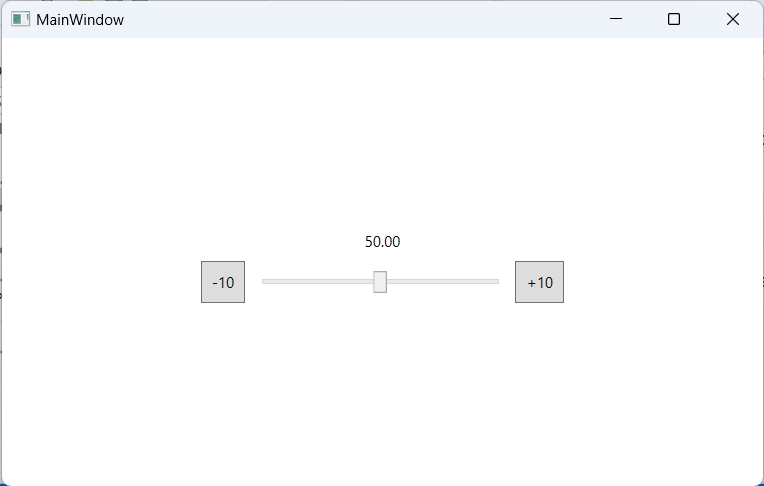
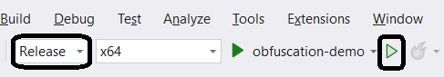
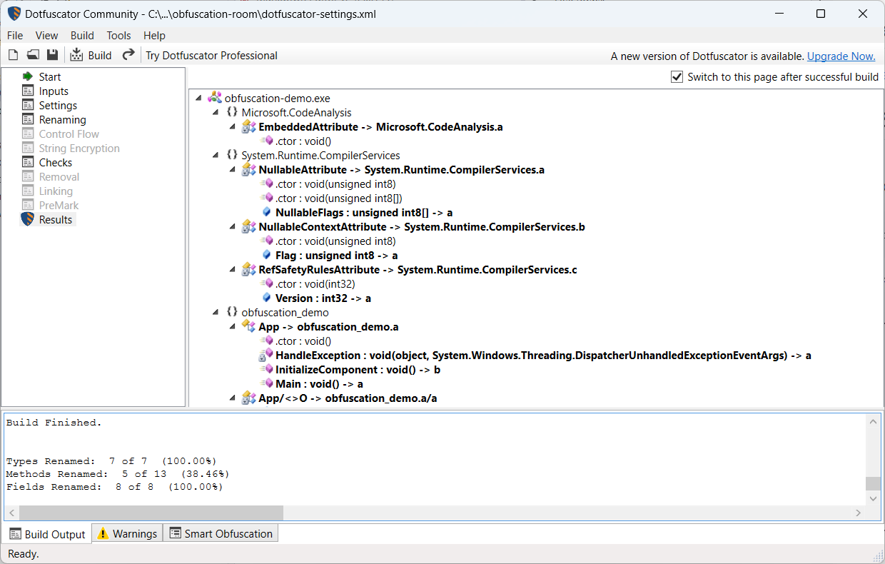
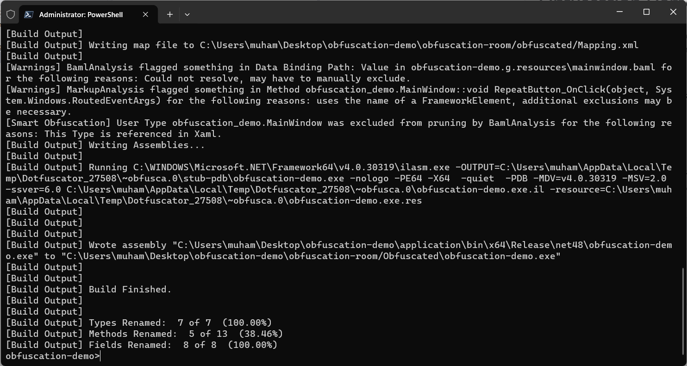
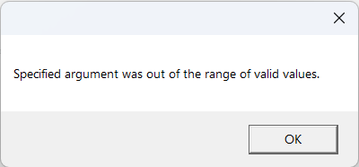
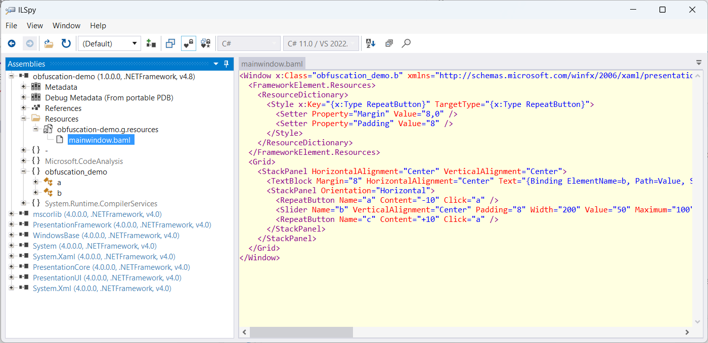
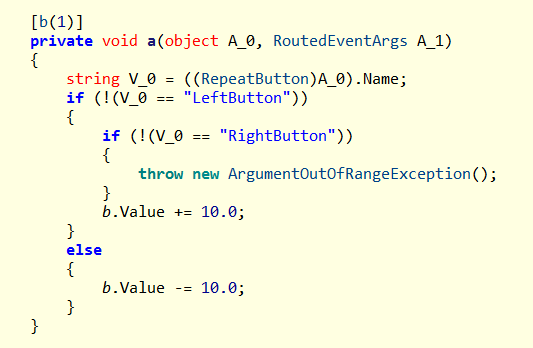
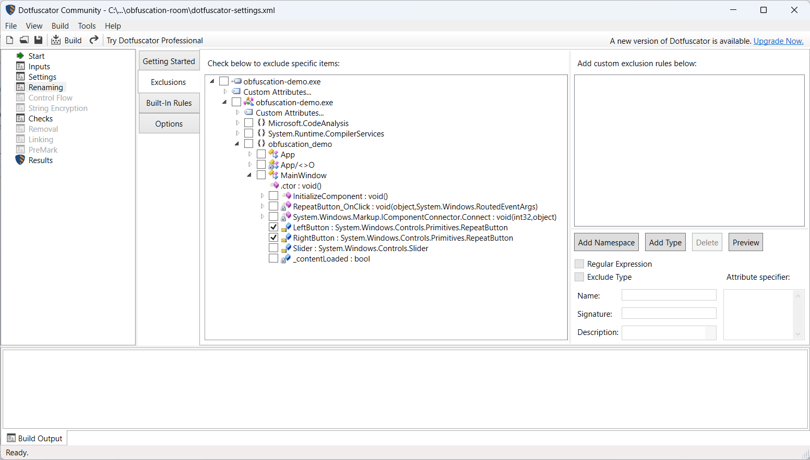
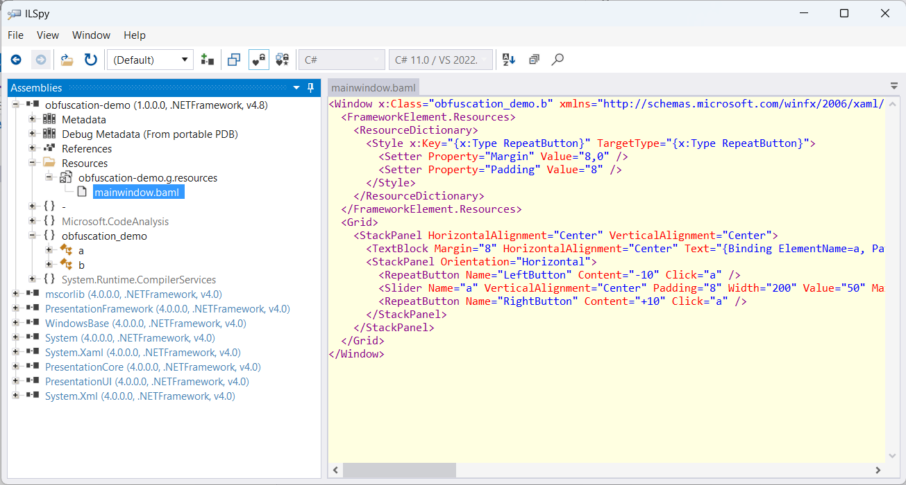

# Obfuscation Demo

Learning how to solve the most common issue with obfuscation, using the #1 obfuscator tool in the market.

## Agenda:

1. Run a simple desktop application (**works fine :)**),
2. Obfuscate the application,
3. Run the obfuscated application (**throws an exception :(**),
4. Reverse-engineer the application (helps understanding the real cause of the runtime exception),
5. Fix the issue (re-obfuscate the .exe and verify everything is working as expected).



## Pre-requisites

[Dotfuscator Community](https://www.preemptive.com/products/dotfuscator/downloads/).

Could be installed within Visual Studio as well,
- VS2022 -> Extensions -> Manage Extensions -> Online -> search for "Dotfuscator Community" -> install (restart Visual Studio).

## Obfuscation

1. Build/Run the application in release mode (or via CLI),

    1. Using Visual Studio

	

	2. Using CLI

	```
	dotnet build -c release
	```

2. Obfuscation

	1. Using Visual Studio

    	1. Open Dotfuscator
		
    		- VS2022 -> Tools -> PreEmptive Protection - Dotfuscator Community.
		2. File -> Open -> browse to `obfuscation-room\dotfuscator-settings.xml` -> Click Open.
		3. Click **Build**
		4. You should get something like this

		

	2. Using CLI

		1. Find `dotfuscator.exe`, (should be at `[VS Install Dir]\Common7\IDE\Extensions\PreEmptiveSolutions\DotfuscatorCE` folder),

    		1. Or, open dotfuscator GUI, open Task Manager, search for `dotfuscatorUI.exe`, right click, open file location.

		2. Add the path of the folder to PATH environmental variables,
		3. Restart the CLI (ex. powershell 7) and run the following command

		```
		dotfuscator .\obfuscation-room\dotfuscator-settings.xml
		```

		4. You should get something like this

		

3. The obfuscated application will be generated at this location  `obfuscation-room\obfuscated\obfuscation-demo.exe`.

4. Run the application, click on any button, exception occurs :(





## Reverse Engineering

Let's decompile the obfuscated application  using popular [ILSpy](https://github.com/icsharpcode/ILSpy).

I've shipped ILSpy binaries with this project (Locate it at `.\obfuscation-room\ILSpy_binaries_8.2.0.7535-x64.zip`).

1. Extract the content of the .zip file then run `ILSpy.exe`,

2. File -> Open -> navigate to `\obfuscation-demo\obfuscation-room\obfuscated\obfuscation-demo.exe` -> Open,

3. You should get something like this



See, `mainwindow.baml`, it is the obfuscated version of `MainWindow.xaml`. Notice how the names of `<RepeatButton/>`s are changed

- `LeftButton` changed to `a`, 
- `RightButton` changed to `c`, 
- `RepeatButton_OnClick` event handler is renamed to `a`

Classes `a` and `b` are the obfuscated versions of `App` and `MainWindow` classes.


## Only problem?

Look at the obfuscated version of `RepeatButton_OnClick`



Got it? 

## **Strings in C# are not renamed (`LeftButton` and `RightButton`), whereas changed in XAML (`a` and `c`). Therefore -at runtime- the code flows to `throw new ArgumentOutOfRangeException();` block, hence the exception occurs.**.


## Solution

1. Open the `dotfuscator-settings.xml` in dotfuscator GUI -> `Renaming` -> `Exclusions`

Exclude the buttons from being renamed.



2. Click **Build**

P.S. Compare the stats between the old build and the new one (after the fix),

- Before (Fields Renamed:  8 of 8  (100.00%))

```
[Build Output] Types Renamed:  7 of 7  (100.00%)
[Build Output] Methods Renamed:  5 of 13  (38.46%)
[Build Output] Fields Renamed:  8 of 8  (100.00%)
```

- After (Fields Renamed:  6 of 8  (75.00%))

```
Types Renamed:  7 of 7  (100.00%)
Methods Renamed:  5 of 13  (38.46%)
Fields Renamed:  6 of 8  (75.00%)
```

You can also compare the old `mainwindow.baml` with the new one (see how buttons' names left untouched, `LeftButton` and `RightButton`).




4. Run the obfuscated application, click on any button, all work.

DONE.